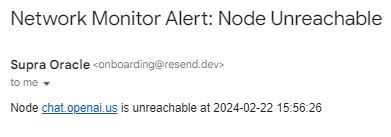

# Network-Monitoring-Tool
A shell script that monitors the network connectivity and status of nodes in the network. 

This tool provide the following functionalities:
1. Ping a list of specified nodes and display the status of each node (reachable or
unreachable).
2. Log the timestamp and status of each node in a file for historical analysis.
3. Provide an option to send an email notification if any node becomes unreachable.



### Set-up

1. Visit (resend.com)[https://resend.com/], create a free account
2. Create an API key on the platform
3. On line 19, change the recipient to the email address you registered on resend
4. On line 56, add your Api Key
5. Add execute permissions to the script: Run `chmod +x network_monitor.sh`

### Execute Script

```
    ./network_monitor.sh ukeme.us
```